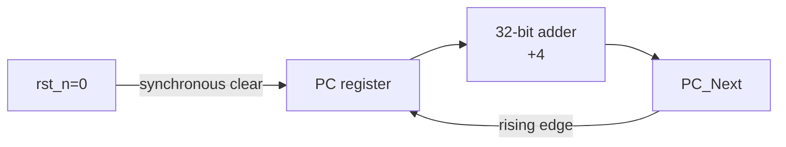

# Subproject 02 - Program Counter and Address Adders

## Engineering objective

Implement the sequential state element that controls instruction flow and the
combinational adder used by both sequential execution (`PC+4`) and branch-target
generation (`PC+ImmExt`).



## Timing contract

- `PC` updates only on the rising edge of `clk`.
- `rst_n` is active low and synchronous; asserting it between edges does not
  change `PC` until the next rising edge.
- `PC_Adder` is purely combinational and has no reset behavior.

## Verification strategy

The regression checks the sequence `0 -> 4 -> 8 -> 12` and explicitly asserts
reset between active edges to distinguish synchronous reset behavior from an
asynchronous implementation.

## Files

- `PC.v` - synchronous 32-bit program counter.
- `PC_Adder.v` - combinational address adder.
- `PC_tb.v` - timing-aware self-checking testbench.
- `run_questa.do` - simulator automation and `pc.vcd` generation.

## Run

```bash
vsim -c -do run_questa.do
gtkwave pc.vcd
```

Expected verdict: `TEST PC AND ADDER PASSED`.

## Review focus

The main design point is the reset contract. The testbench releases and asserts
reset away from the active clock edge, preventing race-prone stimulus and making
the sequential semantics unambiguous.

## Verification matrix

| Requirement | Evidence |
|---|---|
| Synchronous active-low reset | Reset is asserted away from an edge; `PC` changes only at the next rising edge |
| Sequential progression | Checked sequence is `0x0`, `0x4`, `0x8`, `0xC` |
| Combinational addition | `PC_Adder` output is checked independently of clock activity |
| Deterministic recovery | Reasserting reset returns `PC` to zero on the next active edge |

## Integration role

One adder produces `PC+4`; a second instance produces `PC+ImmExt`. The PC module
is the only sequential state in the instruction-address path, so its timing
contract directly defines the visible instruction sequence.

## Scope boundary

The design does not model clock gating, reset synchronization, instruction
alignment exceptions, or clock-domain crossing. It assumes one synchronous
clock domain and architecturally aligned instruction addresses.
